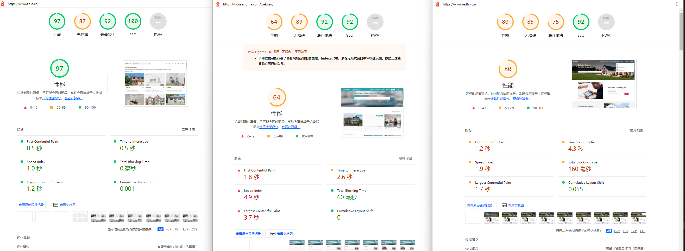

### 写在最前面的问题

* 目前在职，当前职位工作内容比较无趣技术也没什么进步，不符合我的职业规划。好处是没有了通勤，可以更加充分利用时间。不便的话则是全职远程工作沟通会比较困难。
* 未来2年有打算常住在哈尔滨。
* 希望更加精于前端技术，提升水平。收入可以稳定增长，参加更加富裕挑战性的工作。
* 制定一个工作计划，以效率完成工作。
* 个人所得税，社保是怎么交的，劳动合同如何签订？

### 面试问题2 - pagespeed

使用 DevTools 的 Lighthouse 工具分别测试了网站与竞品。

与竞品网站相比首次渲染时间过长，用户体验不好。
可更换图片格式压缩图片，使用 HTTP/2 ，缩短加载时间。
图片元素缺少 [alt] 属性影响SEO。
对于单页面应用，可使用服务端渲染应用框架，解决首页加载慢，不利于 SEO 的问题。

### 面试问题 3

DevTools 的 Memory 工具可以分析是否内存泄漏。
长时间使用页面查看JS堆总大小是否一直增长。

定时器没有清除，图表数据未清空，addEventListener多次绑定事件，没有解绑。闭包都可能引起内存泄漏。

及时清楚定时器，销毁非当前页面图标，在生命周期结束时销毁绑定事件。

我参与我的一个大屏幕展示项目中，Echarts 图表过多，同时没有在轮播页面时及时销毁图表与定时器，导致页面崩溃。
在地图页面中，加载点位过多会引起内存不足导致地图卡死。解决方案是发布地图图层服务更换普通点位加载。

### 面试问题 4

对代码结构和业务逻辑实现做合理划分，同时将需求逻辑抽象成各个组件，用以拼接多端页面。
在修改组件后同时预览测试多端页面，确保日后开发不会踩坑。

在设计多端页面时，可最大限度使用响应式布局设计。用以保证不同端样式修改最少化。

业界成熟方案

腾讯跨端框架- Hippy

滴滴跨端框架 - Chameleon

京东跨端框架 - Taro

阿里无线前端 - Weex
